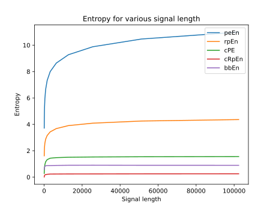
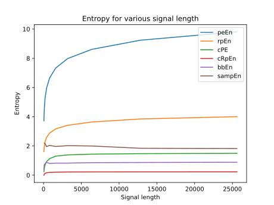
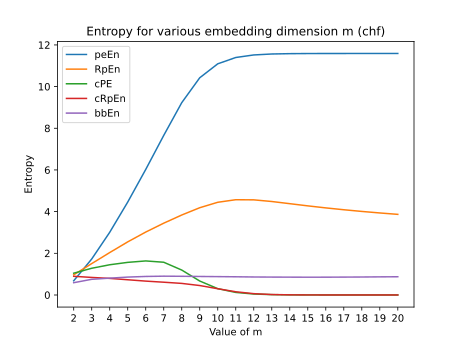
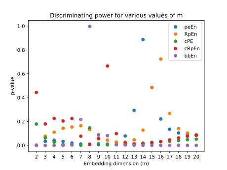
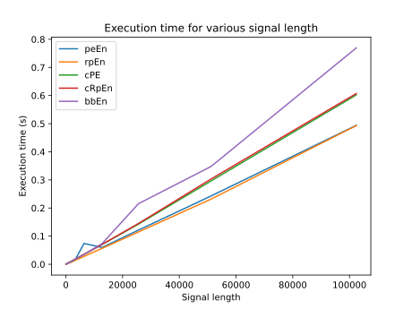

# BSP project
Project for the course "Biomedical Signal Processing", based on the work of George Manis, Md Aktaruzzaman, and Roberto Sassi: "[Bubble Entropy: An Entropy Almost Free of Parameters](https://ieeexplore.ieee.org/document/7842617)".
The aim of this project is the implementation of various algorithms to compute the entropy of a signal based on different entropy definitions and in particular Conditional Rényi Permutation Entropy and Bubble Entropy.
## Requirements
Requirements are defined inside the file `requirements`. 

To easily setup the python env, after cloning the repository:
```bash
cd BSP_proj
python -m venv venv
source venv/bin/activate
pip install -r requirements
```
Also, in order to execute the code in the `test.py` file, it is necessary to gather some data from physionet:
```bash
wget -r -N -c -np https://physionet.org/files/nsr2db/1.0.0/
mv physionet.org/files/nsr2db nsr2/
rm -r physionet.org
wget -r -N -c -np https://physionet.org/files/chf2db/1.0.0/
mv physionet.org/files/chf2db chf2/
rm -r physionet.org
```
## Algorithms
The algorithm implemented, located inside the file `entropy.py`, are:
- `peEn`: Permutation Entropy
- `rpEn`: Rényi Permutation Entropy
- `sampEn`: Sample Entropy
- `cPE`: Conditional Permutation Entropy
- `cRpEn`: Conditional Rényi Permutation Entropy
- `bbEn`: Bubble Entropy
## Data
Tests are performed on two database from phisionet.org:
- [nsr2db](https://physionet.org/content/nsr2db/1.0.0/): This database includes beat annotation files for 54 long-term ECG recordings of subjects in normal sinus rhythm (30 men, aged 28.5 to 76, and 24 women, aged 58 to 73). The original ECG recordings (not available) were digitized at 128 samples per second, and the beat annotations were obtained by automated analysis with manual review and correction.
- [chf2db](https://physionet.org/content/chf2db/1.0.0/): This database includes beat annotation files for 29 long-term ECG recordings of subjects aged 34 to 79, with congestive heart failure (NYHA classes I, II, and III). Subjects included 8 men and 2 women; gender is not known for the remaining 21 subjects. The original ECG recordings (not available) were digitized at 128 samples per second, and the beat annotations were obtained by automated analysis with manual review and correction.
## Test
In order to asses the properties of the implemented algorithms, some tests have been performed:
- **stability test with varying signal length:**
	Here all the algorithms (except sampEn) have been tested on the same randomly sampled 20 signal cut to increasing length N = [50,100,200,400,800,1600,3200,6400,12800,25600,51200,end] and the result is then averaged. The embedding size is fixed and depends on the algorithm.
	A second set of test have been performed including also sampEn, this time due to computational complexity, with only 5 signals and N=[50,100,200,400,800,1600,3200,6400,12800]
- **stability test with varying embedding size:** Here all the algorithms have been tested on the same randomly sampled 20 signal (20 from nsr and 20 from chf) with increasing embedding size m from 2 to 20 and the result is then averaged.
- **discriminating power with varying embedding size:** The entropies obtained from the previous test have been used to compute the p-value discriminating between the two populations (nsr and chf).
- **execution time:** while executing for the other tests the algorithms have been timed and compared.
## Results





